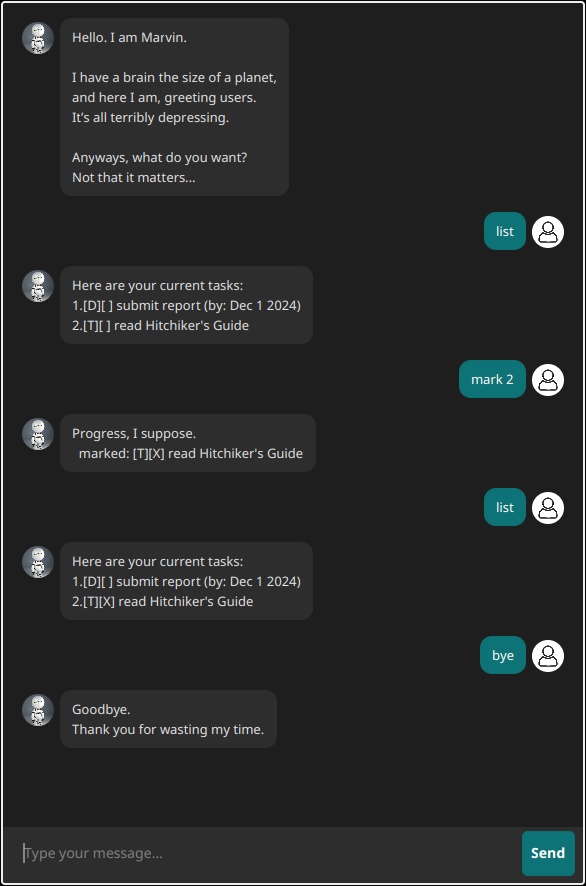

# Marvin User Guide



Marvin is your all powerful, all seeing and all knowing android assistant, there's just one little catch, he's really
depressed. Talk to him through the command line interface (CLI).

## Quick Start

1. Ensure you have Java `17` installed in your Computer.
2. Download the latest `marvin.jar` from the releases page.
3. Copy the file to the folder you want to use as the _home folder_ for your Marvin, Marvin will create files in this
   location to save your data.
4. Open a command terminal, `cd` into the folder you put the jar file in, and use the following command to run the
   application:
   ```
   java -jar marvin.jar
   ```
5. Type the command in the command box and press Enter to execute it. e.g. typing `help` and pressing Enter will open
   the help window.
   Some example commands you can try:

    * `list` : Lists all tasks.
    * `todo read book` : Adds a todo task "read book" to the task list.
    * `deadline submit report --by 2024-12-01` : Adds a deadline task "submit report" by 12 January 2024.
    * `delete 1` : Deletes the 1st task in the current list.
    * `bye` : Exits the app.

6. Refer to the [Features](#features) below for specific details of each command.

## Features

> [!TIP]
> **:information_source: Notes about the command format:**<br>
>
> * Words in `UPPER_CASE` are the parameters to be supplied by the user. They can contain spaces without having to be
    enclosed with apostrophes.<br>
    e.g. in `todo TASK`, `TASK` is a parameter which can be used as `todo read book`.
>
> * Parameters can be in any order.<br>
    e.g. if the command specifies `--from FROM_DATE --to TO_DATE`, `--to TO_DATE --from FROM_DATE` is also acceptable.
>
> * Parameter flags also have a shortened alternative, see the specifics for the shortened flag.<br>
    e.g. in `deadline TASK --by BY_DATE` can be shortened to `deadline TASK -b BY_DATE`
>
> * Extraneous parameters for commands that do not take in parameters (such as `list` and `bye`) will be
    ignored.<br>
    e.g. if the command specifies `list 123`, it will be interpreted as `list`.
>
> * If you are using a PDF version of this document, be careful when copying and pasting commands that span multiple
    lines as space characters surrounding line-breaks may be omitted when copied over to the application.

### Adding a Todo Task: `todo`

Adds a todo task to the task list.

Format:

```
todo DESCRIPTION
```

Example: `todo read book`

### Adding a Deadline Task: `deadline`

Adds a deadline task to the task list.

Format:

```
deadline DESCRIPTION --by BY_DATE
deadline DESCRIPTION -b BY_DATE
```

* Dates must be either formatted as `yyyy-MM-dd` or `d/M/yyyy` to be accepted.

Example: `deadline return book --by 2024-02-29`, `deadline return book -b 29/2/2024`

### Adding an Event Task: `event`

Adds an event task to the task list.

Format:

```
event DESCRIPTION --from FROM_DATE --to TO_DATE
event DESCRIPTION -f FROM_DATE -t TO_DATE
```

* Dates must be either formatted as `yyyy-MM-dd` or `d/M/yyyy` to be accepted.

Example: `event project meeting --from 2024-02-20 -t 20/2/2024`

### Listing all tasks : `list`

Shows a list of all tasks in the task list.

Format: `list`

### Marking a Task as Done: `mark`

Marks a task as done.

Format:

```
mark INDEX
```

* Marks the task at the specified `INDEX` as done.
* The index refers to the index number shown in the displayed task list.
* The index **must be a positive integer** 1, 2, 3, …

Example: `mark 1`

### Marking a Task as Not Done: `unmark`

Marks a task as not done.

Format:

```
unmark INDEX
```

* Marks the task at the specified `INDEX` as not done.
* The index refers to the index number shown in the displayed task list.
* The index **must be a positive integer** 1, 2, 3, …

Example: `unmark 1`

### Deleting a Task: `delete`

Deletes the specified task from the task list.

Format:

```
delete INDEX
```

* Deletes the task at the specified `INDEX`.
* The index refers to the index number shown in the displayed task list.
* The index **must be a positive integer** 1, 2, 3, …

Example: `delete 1`

### Searching for Tasks: `find`

Finds tasks whose names contain the given search term.

Format:

```
find SEARCH_STRING
```

* Only the description is searched.
* Partial words will be matched e.g. `rea` will match `read`

Example: `find book` returns `read book` and `book club`

### Deleting a person : `delete`

Deletes the specified person from the address book.

Format:

```
delete INDEX
```

* Deletes the person at the specified `INDEX`.
* The index refers to the index number shown in the displayed person list.
* The index **must be a positive integer** 1, 2, 3, …

Example: `list` followed by `delete 2` deletes the 2nd person in the address book.

### Exiting the program : `bye`

Exits the program.

Format:

```
bye
```

### Saving your data

AddressBook data are saved in the hard disk automatically after any command that changes the data. There is no need to
save manually.

### Editing the data file

AddressBook data are saved automatically as a JSON file `[JAR file location]/data/tasks.json`. Advanced users are
welcome to update data directly by editing that data file.

> [!WARNING]
> If your changes to the data file makes its format invalid, Marvin may behave in unexpected ways. Hence, it is
> recommended to take a backup of the file before editing it.<br>
> Therefore, edit the data file only if you are confident that you can update it correctly.
